# Mermaid Samples

This page collects representative Mermaid diagrams for the native renderer. Some diagram types are intentionally included before their Avalonia renderer is complete, so this file can work as a living implementation checklist.

## Flowchart

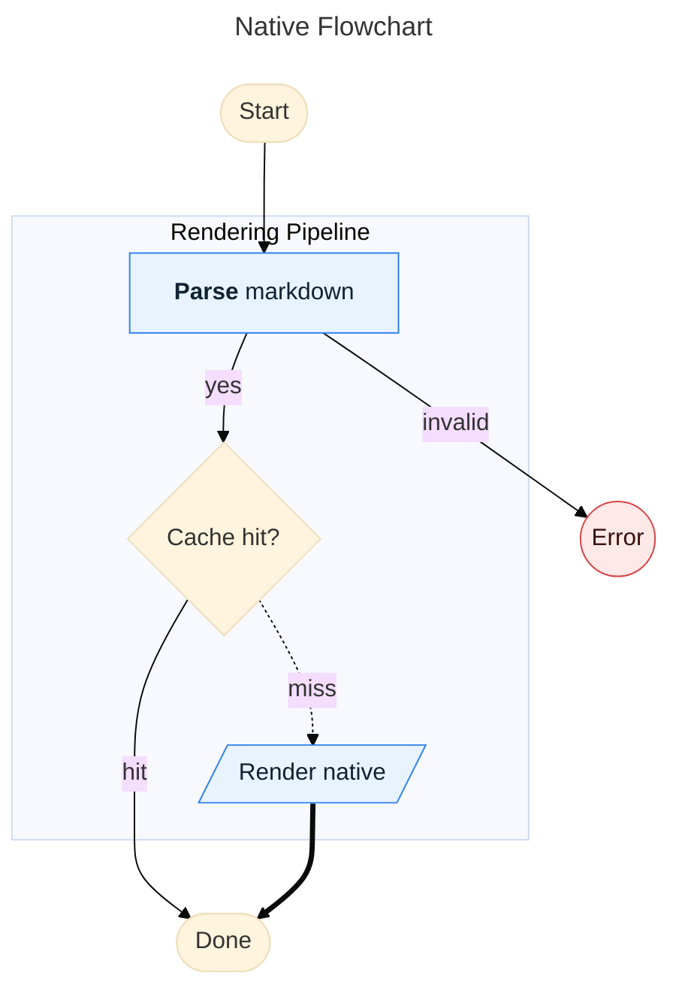

## State Diagram

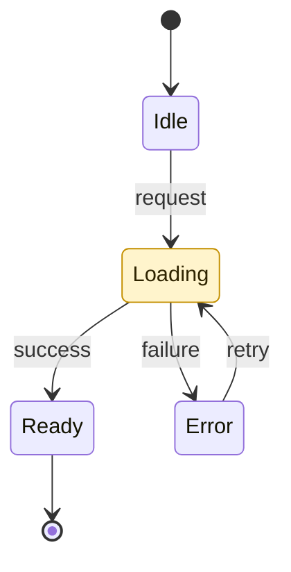

## Sequence Diagram

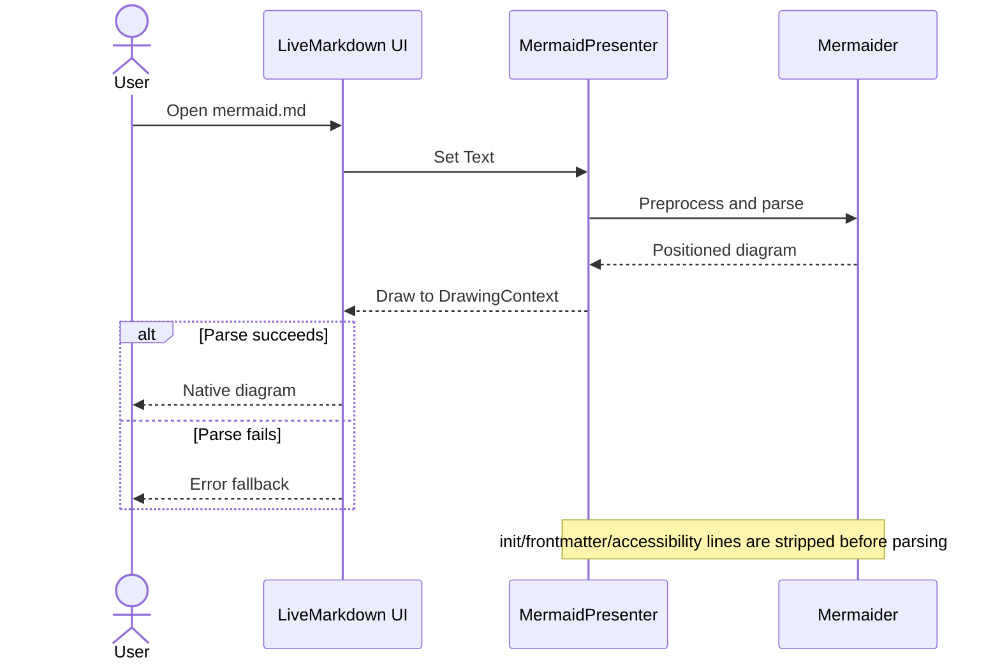

## Class Diagram

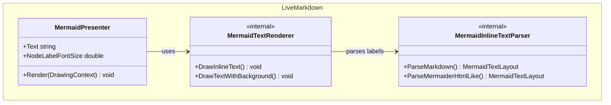

## ER Diagram

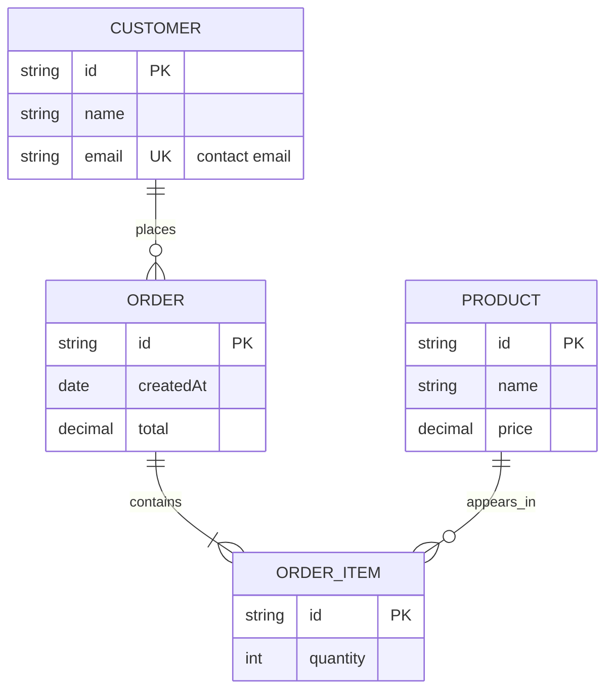

## Pie Chart

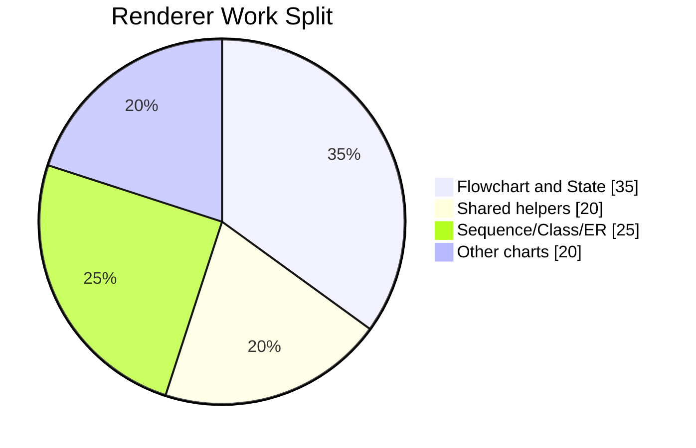

## Quadrant Chart

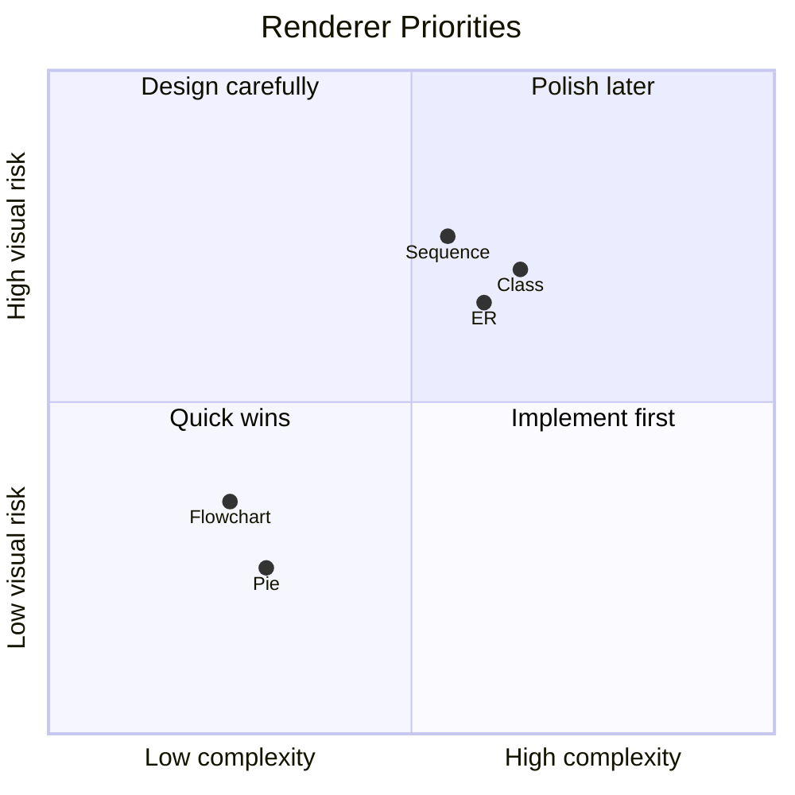

## Timeline

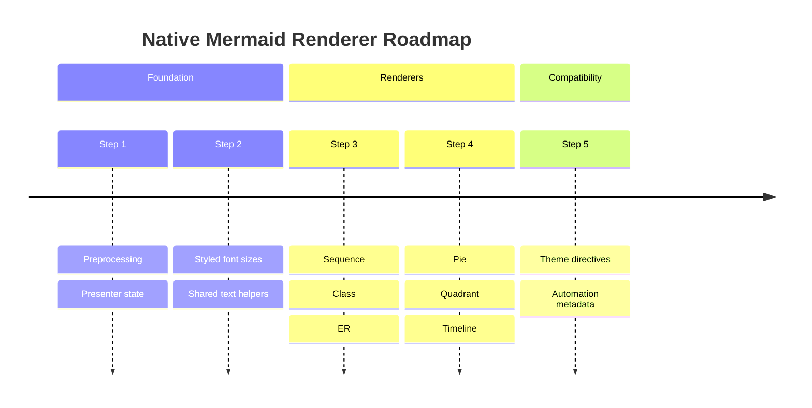

## Git Graph

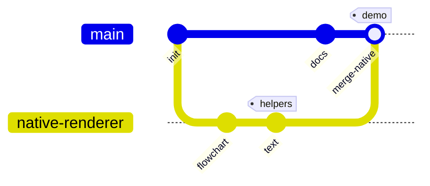

## Radar Chart

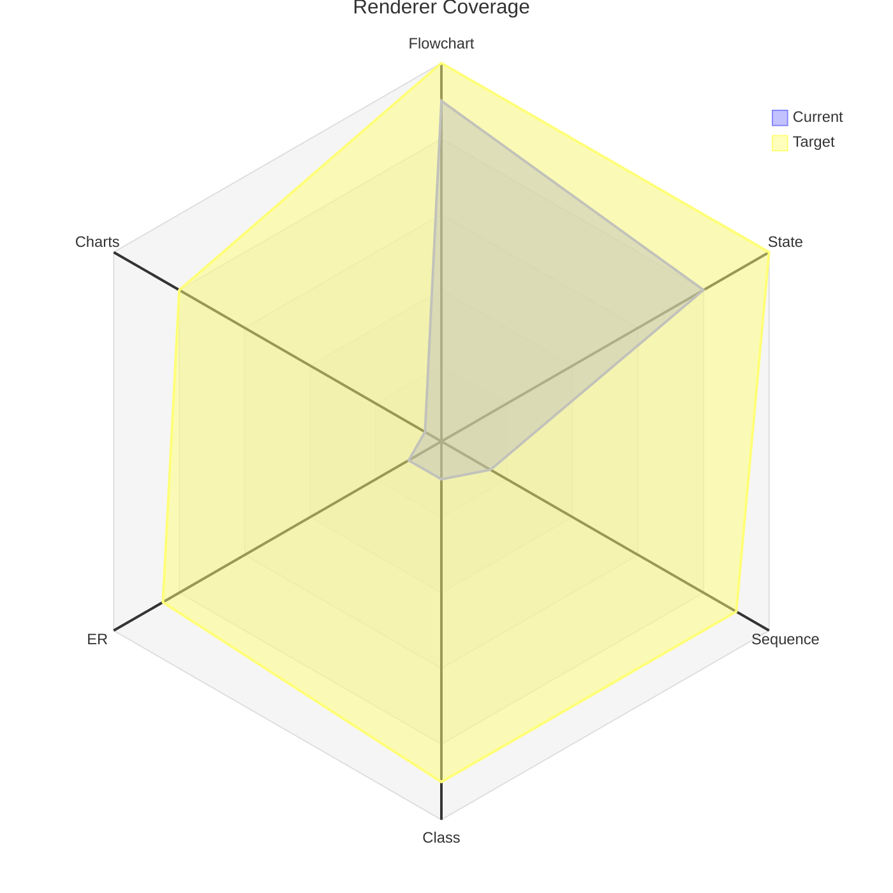

## Treemap

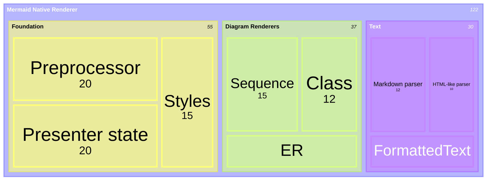

## Venn Diagram

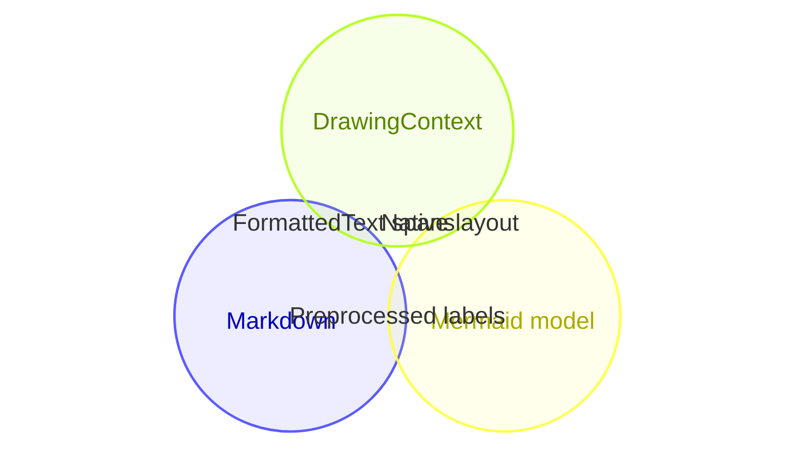
